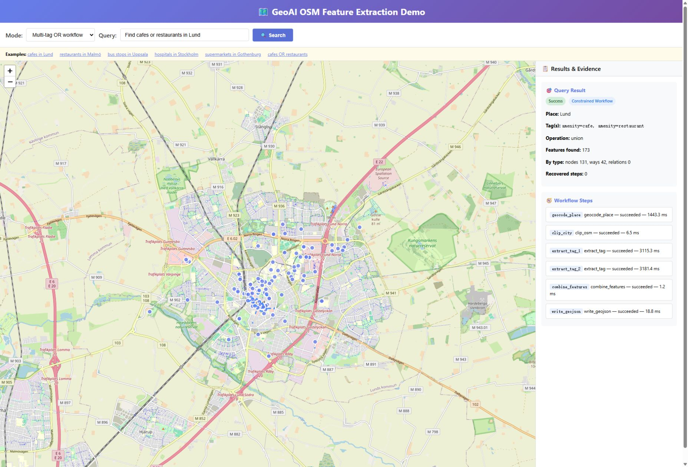
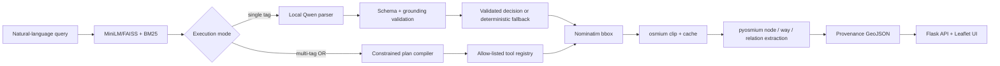

# GeoAI OSM RAG Agent

A local-first, evidence-grounded geospatial agent that converts natural-language requests into validated OpenStreetMap queries and interactive GeoJSON maps.

## Highlights

- Hybrid information retrieval: MiniLM/FAISS dense search, BM25 lexical search, tag-level deduplication, and reciprocal-rank fusion.
- Guarded LLM decisions: local Qwen structured parsing, strict schema and grounding checks, and deterministic fallback.
- Deterministic geospatial execution: Nominatim bounding boxes, `osmium` clipping, `pyosmium` geometry extraction, and provenance-rich GeoJSON.
- Constrained multi-tag workflows: allow-listed tools, explicit step state, bounded retry, cache reuse, timings, and trace IDs.
- Measured internal results: hybrid Recall@1 improved from 82.5% to 100% on a 63-query project-authored benchmark; 48/48 offline tests pass locally.
- Real workflow evidence: a Lund café-or-restaurant query produced 173 deduplicated objects with 6/6 successful tool steps.

> All reported retrieval and workflow numbers come from small, project-authored internal datasets or recorded local runs. They are not external benchmarks or production guarantees.



## System Architecture



The probabilistic decision layer is separated from deterministic spatial execution. Unknown tools, unsupported plan shapes, invalid tags, and ungrounded model outputs are rejected before they reach the OSM pipeline. See [the architecture notes](docs/ARCHITECTURE.md) for interfaces and failure paths.

## Results

| Evaluation | Result | Evidence |
|---|---:|---|
| Dense retrieval, 63 internal queries | Recall@1 82.5%; MRR 0.8854 | `benchmarks/results/p1_baseline.*` |
| Final hybrid retrieval, same 63 queries | Recall@1 100%; MRR 1.0 | `benchmarks/results/p3_hybrid_baseline.*` |
| Local Qwen final decision, 21 internal queries | 85.7% | `benchmarks/results/p3_llm.*` |
| Constrained planning, 12 internal queries | 12/12 exact plans | `benchmarks/results/p4_workflow.*` |
| Lund café + restaurant workflow | 173 deduplicated objects; 6/6 steps succeeded | `benchmarks/results/p4_workflow.*` |
| Offline regression suite | 48/48 passed locally | `tests/` |

The 100% retrieval result does not imply 100% end-to-end semantic accuracy: the separate 21-query local-Qwen evaluation reached 85.7%. This distinction is intentional and retained in the repository evidence.

## Quick Start

The verified local path uses Windows, Miniconda/Anaconda, Ollama, Python 3.10, and roughly 6–8 GB of free disk space. The local Qwen model also requires enough RAM for a 3B-parameter model.

```bat
git clone https://github.com/xi2618zh-s/geoai-osm-rag-agent.git
cd geoai-osm-rag-agent

scripts\setup_env.cmd
conda run -n geoai_project_env python scripts\fetch_osm_data.py
ollama pull qwen2.5:3b
scripts\run_local.cmd
```

Open <http://127.0.0.1:8000/ui>.

The entrypoints use `conda run`, so they do not depend on shell activation. The data script downloads the Sweden PBF from Geofabrik, verifies the provider checksum, and writes a local receipt. The PBF and generated outputs remain untracked.

### API examples

Single-tag RAG and local-LLM query:

```http
POST /chat
Content-Type: application/json

{"query": "Find all cafes in Lund"}
```

Constrained multi-tag workflow:

```http
POST /workflow
Content-Type: application/json

{"mode": "natural_language", "query": "Find cafes or restaurants in Lund"}
```

Deterministic spatial debugging without an LLM:

```http
POST /chat_simple
Content-Type: application/json

{"place": "Lund", "key": "amenity", "value": "cafe"}
```

## Repository Structure

```text
src/rag/          dense, lexical, and hybrid retrieval
src/query/        structured LLM parsing and grounding validation
src/osm/          geocoding, PBF clipping, and geometry extraction
src/agent/        constrained plans, tool contracts, and workflow state
benchmarks/       versioned internal datasets, runners, and result artifacts
tests/            offline contracts, geometry, reliability, retrieval, and delivery
scripts/          data download, reproducibility checks, and Windows entrypoints
docs/             architecture, deployment, demo, and benchmark documentation
```

## Methodology

The knowledge base contains 21 OSM Wiki tag pages split into 144 cleaned chunks. Dense and lexical rankings are deduplicated at the OSM tag level and fused before the local model sees supporting evidence. The model must emit a strict structured decision; validation either accepts a grounded tag or selects a deterministic ranked fallback.

For spatial execution, the system resolves a place through Nominatim, clips the country PBF once, extracts nodes, ways, and relations with `pyosmium`, deduplicates objects, and writes a unique GeoJSON artifact. Multi-tag natural-language support is deliberately limited to explicit English OR requests; API callers can also request object-identity intersection.

## Evaluation

The repository keeps datasets, configurations, runners, summaries, and machine-readable results together. The 63-query retrieval set covers 21 labels with canonical, paraphrased, and contrastive phrasing. A separate 21-query challenge set informed the final fusion weight, so it is treated as validation rather than a blind holdout.

Run the offline suite and reproducibility audit:

```bat
scripts\test_offline.cmd
conda run -n geoai_project_env python scripts\check_reproducibility.py --ci
```

Re-run the final retrieval configuration:

```bat
conda run -n geoai_project_env python -m benchmarks.run_benchmark --retriever-mode hybrid
```

See [benchmark methodology](docs/BENCHMARKS.md) and [`benchmarks/README.md`](benchmarks/README.md) for the full evaluation contract.

## Reproducibility

- `environment.yml` pins Python 3.10 and declares the external `osmium-tool` dependency.
- `requirements.txt` constrains Python packages by compatible version ranges.
- `scripts/fetch_osm_data.py` streams, checks, and atomically installs the external PBF.
- `.github/workflows/ci.yml` defines an offline Linux test job; its status should be judged from GitHub Actions after publication.
- Network services, the first embedding-model download, Ollama, and the large PBF are intentionally excluded from offline CI.

## Limitations

- The knowledge scope is 21 tags and 144 chunks; evaluation sets are small and project-authored.
- Natural-language multi-tag planning supports explicit English OR only.
- Intersection means object-identity intersection, not spatial-topology intersection.
- There is no arbitrary tool calling, autonomous planner, multi-agent system, or long-term memory.
- Nominatim and OSM data change over time, so feature counts are snapshots.
- The Flask service is a local engineering demo, not a hardened public deployment.

## License

No open-source license has been selected. The repository is currently available for viewing and evaluation only; normal copyright rules apply.
