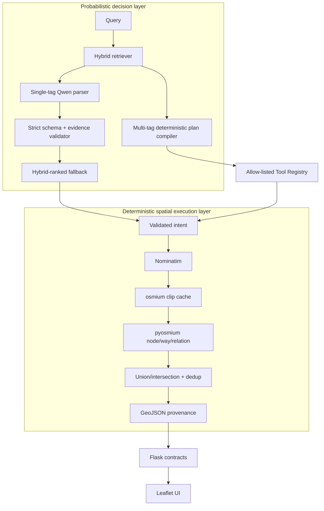
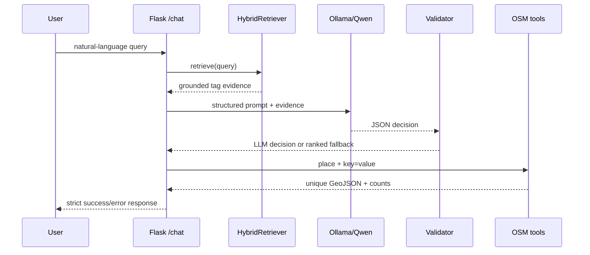
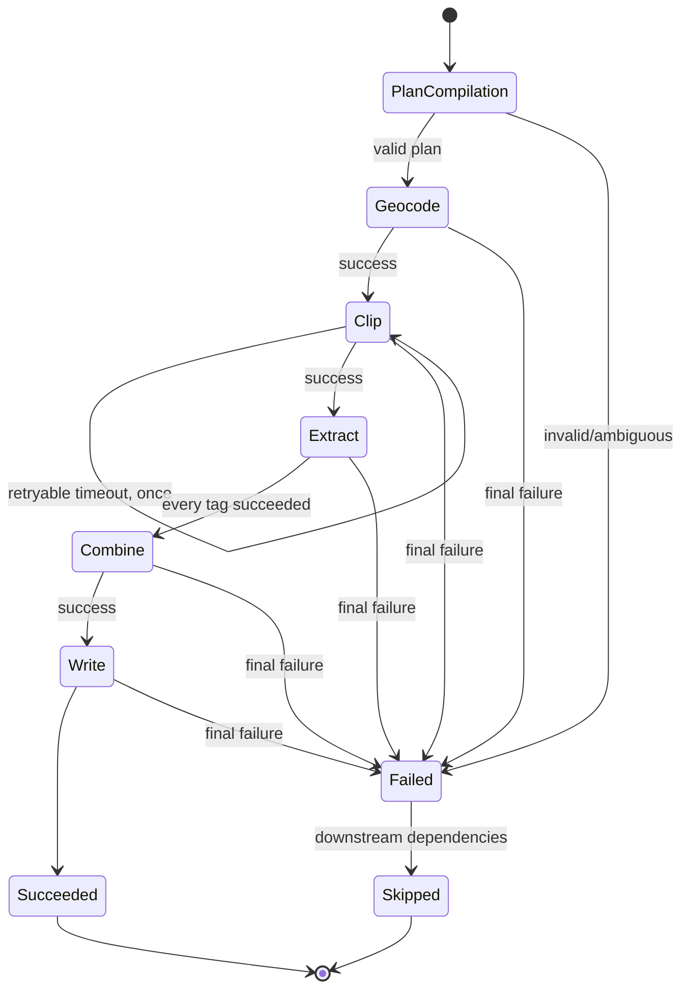

# Architecture and interface map

## 1. Design principle

The system separates probabilistic semantic decisions from deterministic spatial
execution. Retrieval and the local LLM decide *what* OSM tag is relevant. The
spatial layer alone decides *how* real PBF objects are clipped, filtered and
serialized.

## 2. Single-tag request sequence

## 3. Multi-tag workflow state

Each step records status, attempts, recovery, elapsed time, output summary and a
stable error. Tool parameters are validated against `ToolSpec`; unknown tools and
unexpected fields are rejected before a handler runs.

## 4. Core interfaces

| File | Main interface | Responsibility |
|---|---|---|
| `src/rag/hybrid_retriever.py` | `HybridRetriever.retrieve()` | Dense + lexical tag ranking |
| `src/query/llm_parser.py` | structured parser/validator | Grounded local-model decision |
| `src/pipeline.py` | `run_query()` | Backward-compatible single-tag E2E |
| `src/pipeline.py` | `run_query_without_llm()` | Deterministic spatial debugging |
| `src/agent/planner.py` | `compile_natural_language_plan()` | Constrained OR plan |
| `src/agent/tools.py` | `ToolRegistry.invoke()` | Allow-list and tool contracts |
| `src/agent/workflow.py` | `run_agent_workflow()` | Explicit state and recovery |
| `src/osm/extractor.py` | `extract_features_to_geojson()` | node/way/relation geometry |
| `app_min.py` | `/chat`, `/chat_simple`, `/workflow` | HTTP contracts |

## 5. Runtime boundaries

- External network: Nominatim, first MiniLM download, optional Wiki rebuild.
- Local service: Ollama at `127.0.0.1:11434` by default.
- External CLI: `osmium-tool`, installed by Conda or CI apt.
- Large local input: Sweden `.osm.pbf`, never committed.
- Mutable outputs: GeoJSON, clips, logs and caches, all ignored by Git.
- Tracked evidence: source catalog, FAISS index/metadata, tests and benchmark JSON/MD.
